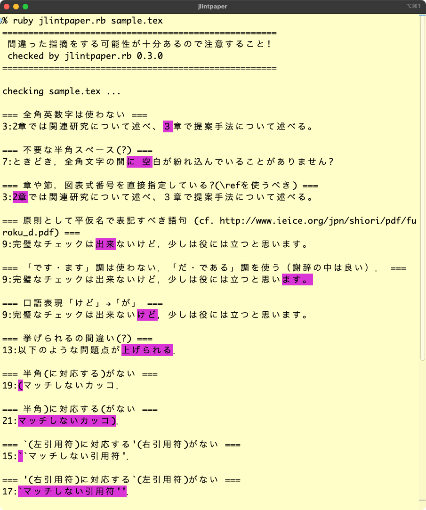

# jlintpaper

LaTeXで書かれた日本語の論文やレポートをチェックし，日本語的あるいはLaTeX的に正しくない可能性がある箇所を指摘します．
間違った指摘があることに注意して下さい．

主に理工系の卒論や修論のチェックに使うことを想定しています．

## 使い方
    Usage: ruby jlintpaper.rb [-m][-h][-d] files...
    日本語のLaTeXのファイルに対して(いいかげんな)警告を出力します．
    オプション:
      -m: ANSI colorを使わない
      -h: ヘルプ (この画面)
      -d: デバッグ用
    例:
      ruby jlintpaper.rb foo.tex bar.tex

デフォルトではカラーで出力します．モノクロで出力する場合は -m オプションを付けて下さい．

## チェック項目
60項目以上あります．
どのようなチェック項目があるかは jlintpaper.rb を見て下さい．

特定のチェックを除くにはソースコード中の当該項目をコメントアウトして下さい．

## 出力例

## 注意
* \input は認識しません
* 必要な指摘をしないことがあります
* 不要な指摘をすることがあります

## License
GPLv3

- - -
Copyright (C) Kota Abe
